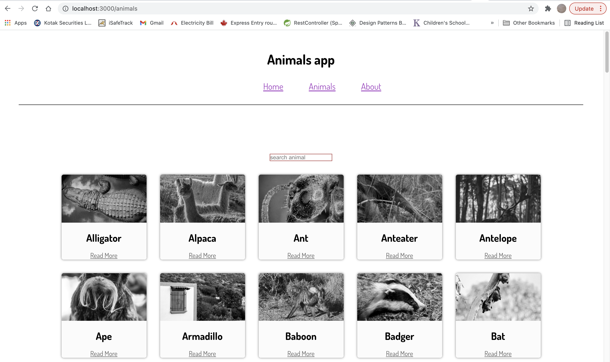

# Animal app

# AnimalsList

- use class component(as we are using states)
- Routing is done here for search and singleAnimal of AnimalList
## searchInput
### set state for searchInput 
- write 
***searchInputHandler()***
```
 searchInput= target.value

 ```
 - filter animal from animals-json which includes searchInput.state.value
 - map animalFilter item to the AnimalCards => animalListing(jsx element)
 - use animalListing object to match the path
 ## match path of a animal to the SingleAnimal

 # AnimalsCard [function component]
 - use unsplash `image` and props.name as `header`
 - use useRouteMatch to match the `link` url to the animal name(props.name)

 # AnimalSingle [function component]
 -use useParams to access animal name
 - useHistory to go back to the animals page
 

 


